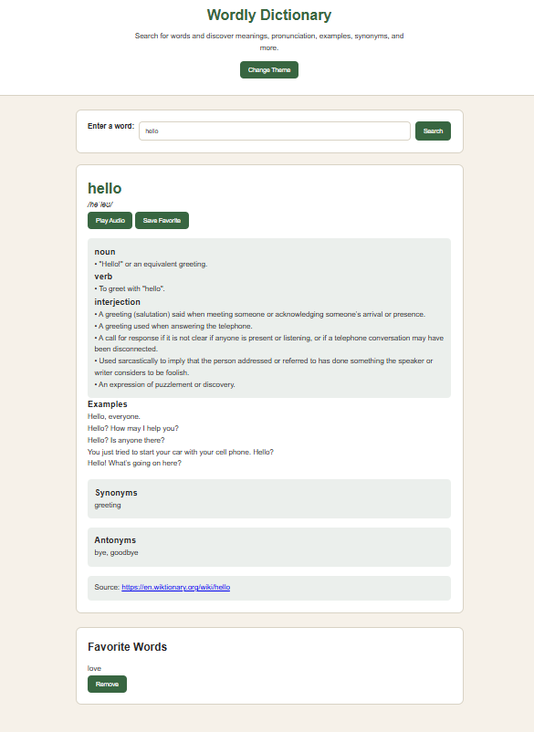

# Wordly Dictionary SPA

## Project Description

Wordly Dictionary SPA is a modern **Single Page Application (SPA)** built using HTML, CSS, and JavaScript. The application allows users to search for English words and instantly retrieve their meanings, pronunciation, examples, synonyms, antonyms, source references, and pronunciation audio without refreshing the page.

The application communicates with the **Free Dictionary API** using the Fetch API to retrieve live dictionary data. It also allows users to save their favorite words using the browser's **localStorage**, ensuring that saved words remain available even after refreshing or reopening the browser.

The project demonstrates modern JavaScript concepts including asynchronous programming, Fetch API, DOM manipulation, event handling, local storage, and responsive web design.

---

# Features

- Search for English words instantly
- Display pronunciation text
- Play pronunciation audio when available
- Display multiple definitions
- Display parts of speech
- Display example sentences when available
- Display synonyms
- Display antonyms
- Display source links from the dictionary
- Save favorite words
- Remove favorite words
- Favorites persist using localStorage
- Search again by clicking a favorite word
- Responsive design for desktop and mobile
- Dark Mode / Light Mode toggle
- Loading indicator while fetching data
- Friendly error messages for invalid searches and network failures

---

# Author Information

**Name:** Abdul Majid Abdullahi

**Email:** abdullahiabdulmajid848@gmail.com

**GitHub:** https://github.com/abdulmajid

---

# Setup Instructions

## Prerequisites

Before running this project, make sure you have:

- A modern web browser (Chrome, Firefox, Edge, Safari)
- Visual Studio Code (recommended)
- Live Server Extension (recommended)

---

## Installation

### 1. Clone the repository

```bash
git clone https://github.com/yourusername/wordly.git
```

### 2. Open the project folder

```bash
cd wordly
```

### 3. Open the project

Open the folder using Visual Studio Code.

### 4. Run the application

You can either:

- Open **index.html** directly in your browser

or

- Right-click **index.html**
- Select **Open with Live Server**

---

# How the Application Works

1. The user enters an English word into the search box.
2. JavaScript listens for the form submission.
3. The application prevents the page from refreshing.
4. A request is sent to the Free Dictionary API.
5. The API returns dictionary information in JSON format.
6. JavaScript extracts:
   - Word
   - Pronunciation
   - Definitions
   - Parts of speech
   - Examples
   - Synonyms
   - Antonyms
   - Source links
   - Audio pronunciation
7. The page updates dynamically without reloading.
8. Users can save favorite words, which are stored in localStorage.
9. Clicking a saved favorite searches that word again instantly.

---

# BDD (Behavior Driven Development)

## Feature: Search for an English Word

### Scenario 1: User searches for a valid word

**Given**

The user is on the Wordly Dictionary page.

**When**

The user enters a valid English word and clicks **Search**.

**Then**

The application displays:

- Pronunciation
- Definitions
- Parts of speech
- Examples (if available)
- Synonyms
- Antonyms
- Audio pronunciation
- Source link

---

### Scenario 2: User submits an empty search

**Given**

The search box is empty.

**When**

The user clicks **Search**.

**Then**

The application displays:

> Please enter a word to search.

---

### Scenario 3: User searches for a word that does not exist

**Given**

The user enters an invalid word.

**When**

The API cannot find the word.

**Then**

The application displays:

> We could not find the word you searched for. Please check the spelling and try again.

---

### Scenario 4: User saves a favorite word

**Given**

The user has searched for a valid word.

**When**

The user clicks **Save Favorite**.

**Then**

The word is added to the favorites list and stored in localStorage.

---

### Scenario 5: User removes a favorite

**Given**

The user has favorite words saved.

**When**

The user clicks **Remove**.

**Then**

The word is removed from both the page and localStorage.

---

### Scenario 6: User clicks a favorite word

**Given**

The favorites list contains saved words.

**When**

The user clicks one of them.

**Then**

The application automatically searches that word again.

---

# Technologies Used

- HTML5
- CSS3
- JavaScript (ES6)
- Fetch API
- Free Dictionary API
- localStorage
- DOM Manipulation
- Event Listeners

---

# Project Structure

```
wordly/
│
├── index.html
├── css/
│   └── style.css
├── js/
│   └── index.js
├── assets/
│   └── homepage.png
└── README.md
```

---

# API Information

This project uses the **Free Dictionary API**.

### Endpoint

```
https://api.dictionaryapi.dev/api/v2/entries/en/{word}
```

Example:

```
https://api.dictionaryapi.dev/api/v2/entries/en/hello
```

The API provides:

- Word
- Phonetic spelling
- Audio pronunciation
- Meanings
- Definitions
- Examples
- Synonyms
- Antonyms
- Source URLs

---

# Usage

1. Open the application.
2. Enter an English word.
3. Click **Search**.
4. View the returned information.
5. Click **Play Audio** to hear pronunciation.
6. Click **Save Favorite** to save the word.
7. Click any saved favorite to search it again.
8. Remove favorites whenever desired.
9. Switch between Light and Dark Mode.

---

# Screenshots

## Home Page

Place your screenshots inside the **assets** folder.

Example:

```
assets/homepage.png
```

Then display it like this:

```markdown

```

---

# Error Handling

The application gracefully handles several situations including:

- Empty search input
- Invalid words
- Missing pronunciation
- Missing audio
- Missing examples
- Missing synonyms
- Missing antonyms
- API failures
- Network connection failures

Friendly messages are shown instead of technical errors.

---

# Responsive Design

The application is fully responsive and works on:

- Desktop
- Laptop
- Tablet
- Mobile devices

The layout automatically adjusts to different screen sizes.

---

# Known Limitations

- Only English words are supported.
- Some dictionary entries do not include audio.
- Some words do not have examples.
- Some words do not contain synonyms or antonyms.
- Information depends entirely on the Free Dictionary API.

---

# Future Improvements

Possible future enhancements include:

- Search history
- Voice search
- Recently searched words
- Multiple language support
- Pronunciation speed control
- Copy definition button
- Share word feature
- Favorite categories
- Offline dictionary support

---

# Live Demo

After deployment, add your live project link here.

Example:

```
https://yourusername.github.io/wordly/
```

---

# GitHub Repository

After pushing your project, add your repository link here.

Example:

```
https://github.com/yourusername/wordly
```

---

# Contact Information

For questions, suggestions, or contributions:

**Email:** abdullahiabdulmajid848@gmail.com

**GitHub:** https://github.com/abdulmajid

---

# License

Copyright © 2026 Abdul Majid Abdullahi

This project was developed for educational purposes as part of a JavaScript Single Page Application (SPA) assessment.

You are free to study, modify, and use this project for learning purposes.

---

# Acknowledgements

Special thanks to:

- Free Dictionary API
- MDN Web Docs
- JavaScript documentation
- HTML5 documentation
- CSS3 documentation
- Open-source developer community

---

# Last Updated

July 2026